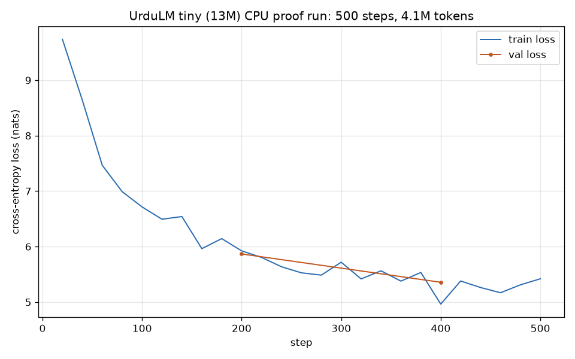

# urdu-slm

A small Urdu language model trained from scratch: the full stack, from raw
public text to a decoder-only transformer, built for a low-resource language
that off-the-shelf tokenizers and models handle poorly.

This repository is **phase 1**: the complete, verified pipeline plus a tiny
proof-run trained here on CPU. **Phase 2** (the real ~124M-parameter model) is a
one-command GPU launch that has not been run yet; see the status section.

Why build it: most "train a GPT" projects reach for English data and a
pretrained tokenizer. Urdu (Perso-Arabic script, right-to-left, rich morphology)
exposes the parts those projects skip: script normalization, a tokenizer that
does not shred the language into bytes, script-aware language-ID filtering, and
an honest token budget for a corpus that is small by design. Everything here is
written from scratch in PyTorch, with no modeling code from the transformers
library.

## What is in it

- **Data pipeline** (`pipeline/`): streaming, resumable stages that download and
  clean public Urdu text into tokenized training shards.
- **Tokenizer**: a 32k byte-level BPE trained on the cleaned corpus, with a
  measured compression comparison against GPT-2's tokenizer on Urdu.
- **Model** (`model/`): decoder-only transformer with RMSNorm, rotary position
  embeddings, SwiGLU MLP, tied embeddings, grouped-query-capable attention.
  Three size presets (`tiny`, `small`, `base`).
- **Training** (`train.py`): AMP (bf16 on GPU, fp32 on CPU), gradient
  accumulation, cosine LR with warmup, grad clipping, token-count scheduling,
  full resume (optimizer + scheduler + data cursor), JSONL metrics, single-GPU
  and DDP (`torchrun`) paths, deterministic seeding.
- **Evaluation** (`eval/`): held-out perplexity, a script-mix diagnostic, and a
  few-shot cloze harness over a hand-written 45-item Urdu eval set
  (`evaldata/`).
- **GPU-run readiness**: `configs/base.yaml` + `docs/GPU_RUN.md` with the launch
  command, a cost estimate, and Chinchilla-style token-budget reasoning.

## Architecture

```
raw text (Wikipedia dump, Leipzig corpora)
  -> pipeline/build_corpus.py
       extract   : parse wikitext / read sentences, NFC-normalize Urdu,
                   filter boilerplate + short lines, script-range language ID
       dedup     : exact (blake2b) + near (vectorized MinHash + LSH)
       split     : deterministic train/val
  -> data/{train,val}/*.jsonl  (+ corpus_stats.json)
  -> pipeline/train_tokenizer.py   -> tokenizer/tokenizer.json (32k BPE)
  -> pipeline/tokenize_corpus.py   -> data/{train,val}.bin (uint16 token stream)
  -> train.py --config configs/<preset>.yaml  -> runs/<preset>/{ckpt.pt, model.pt}
  -> eval/*, sample.py
```

The transformer (`model/transformer.py`) is a pre-norm decoder stack:
RMSNorm -> RoPE causal self-attention -> residual -> RMSNorm -> SwiGLU -> residual,
with a tied input/output embedding and `scaled_dot_product_attention` for the
causal attention (Flash kernels on GPU).

| preset | params | layers | d_model | heads | context |
| ------ | ------ | ------ | ------- | ----- | ------- |
| tiny   | 13.0M  | 6      | 256     | 4     | 512     |
| small  | 35.7M  | 6      | 512     | 8     | 1024    |
| base   | 123.7M | 14     | 768     | 12    | 1024    |

At a 32k vocabulary the `tiny` preset is dominated by its 8.2M-parameter
embedding table; the transformer blocks add ~4.8M. That is inherent to a small
model with a real subword vocabulary, and it is reported honestly rather than
hidden by shrinking the vocab.

## Corpus (real numbers from this machine)

Built 2026-07-06 from two no-auth public sources (licenses in
`docs/DATA_LICENSES.md`):

| source | raw units | kept (post-filter) | kept after dedup | chars |
| ------ | --------- | ------------------ | ---------------- | ----- |
| Urdu Wikipedia (dump) | 1,728,010 articles | 2,459,293 paragraphs | 1,309,831 | 370.2M |
| Leipzig newscrawl 2016 (1M) | 1,000,000 sentences | 960,189 | 930,452 | 122.7M |
| Leipzig newscrawl 2011 (300K) | 300,000 sentences | 276,005 | 274,799 | 32.2M |
| **total** | | **3,695,487** | **2,515,082 docs** | **438.5M** |

Filtering (NFC normalization, script-range language ID at 0.65 Arabic ratio,
min 40 chars / 6 words, boilerplate drop) then exact + near dedup removed
**31.9%** of the extracted paragraphs (871,272 exact duplicates + 309,133
MinHash near-duplicates). Urdu Wikipedia's large population of bot-generated stub
articles is the main reason the dedup rate is that high. Final split:
**2,489,976 train** docs / **25,106 val** docs (deterministic 1% holdout).

Cleaned token stream (after 32k BPE tokenization): **111.7M train tokens** +
1.1M val tokens = 112.8M total. That is ~0.9 tokens per `base` parameter, which
drives the honest token-budget discussion in `docs/GPU_RUN.md`.

## Tokenizer compression (measured)

A 32k byte-level BPE trained on the cleaned corpus, compared against GPT-2's
tokenizer on a held-out Urdu sample:

| tokenizer | tokens for the sample | chars/token | tokens vs ours |
| --------- | --------------------- | ----------- | -------------- |
| ours (32k Urdu BPE) | 197,758 | **4.078** | 1.0x |
| GPT-2 (50k English BPE) | 1,034,831 | 0.779 | **5.23x more** |

Measured on an 806,495-character held-out Urdu sample
(`python -m eval.tokenizer_compare --gpt2 <gpt2 tokenizer.json>`). GPT-2 spends
**5.23x more tokens** on the same Urdu text (0.78 chars/token, i.e. it mostly
emits one token per UTF-8 byte). GPT-2's English-trained merges fall back to
multiple tokens per Urdu character, so an Urdu-native tokenizer trains and serves
the same corpus for roughly a fifth of the token count.

## Tiny proof run (executed here, CPU)

The `tiny` (13M) preset was trained on this 8-core CPU on a slice of the real
corpus to demonstrate the pipeline end to end. Config: `configs/tiny.yaml`,
block size 256, effective batch 8,192 tokens/step, cosine LR to 6e-4.

- **500 steps, 4.10M tokens seen** (stopped at a checkpoint boundary; the point
  is a clean curve, not a long run).
- Train loss **9.74 → 5.42**; held-out val loss **5.87 (ppl 353) → 5.36 (ppl
  212)** across the two evals during training.
- Final held-out perplexity (fuller eval on `data/val.bin`): **248.8**.
- Script-mix diagnostic: **98.2% of generated characters are Arabic script**
  (1.8% Latin), i.e. the model learned to stay in Urdu.
- Cloze probe (`evaldata/cloze.jsonl`, 45 items, 3 options each): **0.378**,
  slightly above the 0.333 random baseline. This is a probe built for the
  phase-2 model; near-chance here is expected and honest for a 500-step CPU run.



The saved slim checkpoint is `runs/tiny/model.pt` (52MB, weights + config only;
the 156MB optimizer-state resume checkpoint is not committed). Sample
continuations from it are below. They are **barely coherent by design**: 13M
parameters and 500 CPU steps is a pipeline proof, not a capability claim. Note
they are real Urdu words and stay on loosely related topics (cricket, Pakistan),
with loose grammar.

```
prompt : پاکستان ایک
output : پاکستان ایک بڑی تعداد ہے جو پاکستان کرکٹ لیگ لیگ (ن) میں مصروف ہے۔
         پاکستان کی سلامتی لیگ لیگ (ن) پاکستان سے قبل پاکستان کی تاریخ کرکٹ ٹیم ہے۔

prompt : اردو زبان
output : اردو زبان اور "یہ" (پیدائش:الول-16) ایک انگریز کرکٹ کھلاڑی ہے جس نے
         1999ء کے آغاز کے لیے فرسٹ کلاس کرکٹ کھیلی۔

prompt : آج موسم
output : آج موسم میں کوئی صورت نہیں ہوا؟ان کے نام پر بھی ایک اہم کام بھی کہا جائے
         اور اس لیے اس کے علاوہ ہم نے اپنی بات کو یہ ہے کہ اس کی وجہ سے یہ
```

Reproduce with `python sample.py --ckpt runs/tiny/model.pt --seed 7`.

## Setup

```bash
python -m venv .venv && source .venv/bin/activate
pip install -r requirements.txt
# on a GPU box, install the CUDA torch build instead:
#   pip install torch --index-url https://download.pytorch.org/whl/cu124
```

## Usage

```bash
# 1. reproduce the corpus (see below for the download step)
python -m pipeline.build_corpus --raw-dir $URDU_SLM_RAW_DIR --out-dir data \
    --wiki urwiki-latest-pages-articles.xml.bz2 \
    --leipzig urd_newscrawl_2016_1M.tar.gz:leipzig_newscrawl_2016 \
    --leipzig urd_newscrawl_2011_300K.tar.gz:leipzig_newscrawl_2011

# 2. tokenizer + token stream
python -m pipeline.train_tokenizer --data-dir data --out-dir tokenizer
python -m pipeline.tokenize_corpus --data-dir data --tokenizer tokenizer/tokenizer.json

# 3. train (tiny on CPU, or a preset on GPU)
python train.py --config configs/tiny.yaml
python train.py --config configs/tiny.yaml --resume     # resumes exactly

# 4. evaluate + sample (runs/tiny/model.pt is the shipped slim checkpoint)
python -m eval.perplexity --ckpt runs/tiny/model.pt --bin data/val.bin
python -m eval.tokenizer_compare --gpt2 /path/to/gpt2/tokenizer.json
python -m eval.script_mix --ckpt runs/tiny/model.pt
python -m eval.cloze --ckpt runs/tiny/model.pt
python sample.py --ckpt runs/tiny/model.pt
```

### Reproduce the corpus

Raw downloads are intentionally kept out of the repo. Fetch them into a scratch
directory first:

```bash
mkdir -p $URDU_SLM_RAW_DIR && cd $URDU_SLM_RAW_DIR
curl -LO https://dumps.wikimedia.org/urwiki/latest/urwiki-latest-pages-articles.xml.bz2
curl -LO https://downloads.wortschatz-leipzig.de/corpora/urd_newscrawl_2016_1M.tar.gz
curl -LO https://downloads.wortschatz-leipzig.de/corpora/urd_newscrawl_2011_300K.tar.gz
```

The `data/` directory in this repo holds `val.bin` (2.2MB) and `corpus_stats.json`,
but not `train.bin`: at 214MB it exceeds GitHub's 100MB per-file limit, so it is
gitignored rather than committed. Regenerate it locally with:

```bash
python -m pipeline.build_corpus --raw-dir $URDU_SLM_RAW_DIR --out-dir data \
    --wiki urwiki-latest-pages-articles.xml.bz2 \
    --leipzig urd_newscrawl_2016_1M.tar.gz:leipzig_newscrawl_2016 \
    --leipzig urd_newscrawl_2011_300K.tar.gz:leipzig_newscrawl_2011
python -m pipeline.tokenize_corpus --data-dir data --tokenizer tokenizer/tokenizer.json
```

A single sample shard is kept under `data/sample/` for inspection without needing
the full corpus.

## Testing

```bash
python -m pytest tests/ -q
```

12 tests, all passing (5 model, 7 pipeline).

Model tests cover forward-pass shapes, the causal-masking property (perturbing a
future token cannot change earlier-position logits), tied embeddings, and
parameter counts per preset. Pipeline tests cover normalization, script-range
filtering, and exact + near dedup.

## Status

- Phase 1 (this repo): **done and verified here.** Real corpus built, tokenizer
  trained, tests passing, tiny model trained on CPU with a decreasing loss curve
  and saved checkpoint.
- Phase 2 (base model): **not trained yet.** The ~124M `base` run is a budget
  decision, not an engineering one; `docs/GPU_RUN.md` has the one command, cost
  estimate, and token-budget reasoning. No base weights are claimed or shipped.

## Challenges

- **Near-dedup was two hours slow.** The first `Deduper` used datasketch's
  per-shingle `MinHash.update()`, which loops in Python and runs a tiny numpy op
  per shingle. Benchmarked on real Wikipedia paragraphs it managed ~250 docs/s,
  which extrapolated to over two hours for the full corpus. I rewrote
  `build_minhash` to hash all of a document's shingles with xxhash and compute
  the whole signature in two vectorized numpy operations
  (`(np.outer(hv, a) + b) % prime & max_hash`, then `min(axis=0)`), writing the
  result straight into a datasketch `MinHash` so the LSH banding stays
  identical. Measured throughput went to ~2400 docs/s, a ~10x speedup, and the
  same benchmark run confirmed near-duplicates are still caught.
- **datasketch 2.0 changed the MinHash constructor.** Passing `permutations=`
  without a `scheme` raised `ValueError: scheme must be specified explicitly`.
  The fix was to read the seed MinHash's `scheme` (`affine32`) and pass it
  explicitly on every constructed MinHash so all signatures share one scheme and
  LSH comparisons remain valid.
- **The "~10M" tiny preset is embedding-bound.** At a 32k vocabulary the tied
  embedding table alone is 8.2M parameters, so a genuinely tiny transformer
  still lands around 13M and the initial parameter-count test failed at 15.2M.
  Rather than shrink the vocab to hit a round number, I tuned the block dims to
  a defensible 13M and documented that ~8.2M of it is the vocabulary. The
  `base` preset needed 14 layers (not the textbook 12) to reach 124M, because
  the SwiGLU MLP at an 8/3 ratio is smaller than GPT-2's 4x GELU block.
- **Urdu Wikipedia is mostly bot-generated stubs.** Extraction produced far more
  paragraphs than the ~200k article count suggests, because Urdu Wikipedia has a
  very large number of near-identical bot-created stub articles. This is exactly
  what the exact + near dedup stage exists to collapse, and the corpus stats
  below show the dedup rate it removed.
- **Language-ID without a heavyweight model.** fastText's `lid.176` model is
  126MB and adds a download plus a dependency. Because Urdu shares its script
  only with other Perso-Arabic languages that do not appear at volume in these
  sources, a script-range ratio (`arabic_ratio`) catches the real contaminant
  (embedded English) directly. Writing the filter test surfaced an off-by-count
  bug in my own expectation ("اردو and english" is 4 Arabic of 16 letters =
  0.25, not the 0.5 I first assumed), which the test now pins.

## What I learned

- Vectorizing the hot loop matters more than picking a "fast" library: the same
  datasketch LSH went from unusable to fine purely by moving per-element work
  into two numpy calls per document. Profile the real workload before scaling it
  up, not after.
- MinHash signatures only need to be internally consistent for LSH to work. That
  freedom let me swap datasketch's sha1 element hash for xxhash and set
  `hashvalues` directly, as long as every document used the same scheme and
  permutations.
- With a real 32k subword vocabulary, a "10M-parameter" model is a fiction below
  a certain size: the embedding table dominates. Reporting the embedding vs
  block split is more honest than tuning the vocab to hit a headline number.
- SwiGLU at an 8/3 hidden ratio is deliberately sized to match a 4x GELU block's
  parameter count, so a SwiGLU model needs more depth than a classic GPT-2 to
  reach the same total. Depth, not the textbook layer count, is what hits a
  target size.
- RoPE plus `scaled_dot_product_attention(is_causal=True)` is enough to get a
  correct, Flash-ready causal transformer with no hand-written mask, and the
  causal property is cheap to test directly (perturb a future token, assert
  earlier logits are unchanged).
- A resumable, token-count-scheduled loop is worth building up front: it is the
  difference between "the phase-2 GPU run is one command" and "someone has to
  babysit step counts."

## What I'd do differently

- **Parallelize extraction.** The single-process wikitext parse is the slowest
  stage by far (the whole bz2 dump is walked on one core). A multiprocessing
  pool over pages, or the pre-extracted Wikipedia datasets, would cut corpus
  build time several-fold.
- **Persist MinHash signatures to disk.** Dedup currently holds the LSH index in
  RAM and recomputes signatures every run. Writing signatures to a shard file
  would make the dedup stage independently resumable and let me re-tune the
  Jaccard threshold without re-hashing.
- **Cap Wikipedia bot stubs earlier.** So much of the raw Urdu Wikipedia is
  templated stubs that a source-specific pre-filter (drop pages under a length
  or with template-heavy markup) would shrink the input to the dedup stage
  instead of relying on it to clean up afterward.
- **Add a real fastText LID fallback as an option.** The script-range heuristic
  is right for these sources, but a mixed-script web crawl (CC-100, OSCAR) would
  need token-level language ID. I'd wire fastText behind a flag rather than
  assume the heuristic always holds.
- **Tokenizer ablations.** I shipped one 32k byte-level BPE. For a morphologically
  rich language it would be worth measuring 24k/48k vocabularies and a Unigram
  model against the same Urdu sample before committing the phase-2 vocab.

## License

Code: MIT (`LICENSE`), Copyright (c) 2026 Salman Adnan. Training data carries its
own terms: Urdu Wikipedia is CC BY-SA 4.0 and the Leipzig corpora are CC BY-NC
4.0, so any released weights inherit a non-commercial restriction. See
`docs/DATA_LICENSES.md`.
